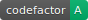

# References

## 1. Building Docker Container

I have built a Docker Container for situations where you dont want to download and install any softwares or packages directly in your computer. You can use this virtualization feature of Docker to keep your computer clean :).

Check out the [Contributing file](./Contributing.md) for more details about setting up and running the `Docker` container.

## 2. Building Vs-Code Development Container

In this section, I have detailed a few links which helped me in using the docker container image to form a dev-container for vs-code.
As this repository contains codes in `python`, `c++`, and `java`, I cannot use any of the following dev containers directly, and thus have take up the core of each of these container files to build my container.

#### File reference for java Container :
https://github.com/microsoft/vscode-remote-try-java

I havent installed Maven not Gradle, as this repository and thus the docker image is just used for Competitive programming.

#### File Reference for Python
https://github.com/microsoft/vscode-remote-try-python

I havent installed PIP, as this repository and thus the docker image is just used for Competitive programming.

#### File Reference for C++
https://github.com/microsoft/vscode-remote-try-cpp

## 3. Setting Up Code-Factor

I have set up `CodeFactor` for this repository and it manages the quality of the code, and can be used to improve the overall code quality.
It has been linked to this repository through web-hooks, and is triggered for every push, pull request, and other activities, where it observes the code to find errors or bad coding styles.
We can view all these details once we log into the CodeFactor portal, which lists all the errors, and also warnings regarding security loopholes, or style warnings in general. We can raise an issue directly from their page if the need arises.
This allots an overall score for the repository, which can be viewed right from anywhere by using badges like the one below :

This badge in the [Readme file](./Readme.md) is updated with every activity (push, pull request, etc) in this repository.
